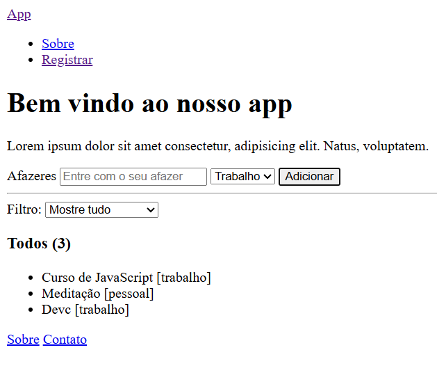

# app-tarefas
 App de Tarefas - exercício desenvolvido pelo curso do DevStart.

## Sobre o Projeto

Projeto com a estilização simples.

Intuito do projeto é desenvolver o conhecimento com POO - Programação Orientada a Objetos.

Precisa implementar sete métodos de instância para que o aplicativo funcione. Assim que você tiver os dois primeiros métodos implementados, poderá testá-los na guia de visualização.

1. obterTudo() Este método deve retornar todos os afazeres.

2. obterContagem() Este método deve retornar um número representando a quantidade total de afazeres.

➡️ Depois de implementar esses dois métodos, você poderá ver os dois exemplos de afazeres renderizados na guia de visualização. Tente inserir afazeres usando o formulário. Ele falhará até que você implemente o próximo método.

3. adicionar(titulo, categoria) Este método recebe duas strings: titulo e categoria. Ele deve adicionar um novo objeto à matriz de objetos existente, seguindo o mesmo formato.

➡️ Uma vez implementado este método, você poderá adicionar afazeres usando o formulário na guia de visualização.

4. obterTrabalho() Este método deve retornar uma matriz de objetos contendo apenas os afazeres que possuem a categoria trabalho . O formato dos objetos dentro da matriz deve permanecer o mesmo.

5. obterContagemDeTrabalho() Este método deve retornar um número representando quantos afazeres possuem a categoria trabalho . Tente manter seu código DRY (Don't Repeat Yourself), isto é, não seja repetitivo.

➡️ Agora você poderá filtrar afazeres por categoria de trabalho na guia de visualização.

6. obterPessoal() Este método deve retornar uma matriz de objetos contendo apenas os afazeres que possuem a categoria pessoal. O formato dos objetos dentro da matriz deve permanecer o mesmo.

7. obterContagemPessoal() Este método deve retornar um número representando quantos afazeres possuem a categoria pessoal. Tente manter seu código DRY (não seja repetitivo).

## Funcionalidades

Botão 

## Tecnologias Utilizadas

🌐 HTML5

🎨 CSS3 (Grid Layout)

⚡ JavaScript (ES6+)

### Links

- Solution Github: [Repository](https://github.com/Jascran23/devcl-calculator)
- Live Site: [Solution Page](https://jascran23.github.io/devcl-calculator/)